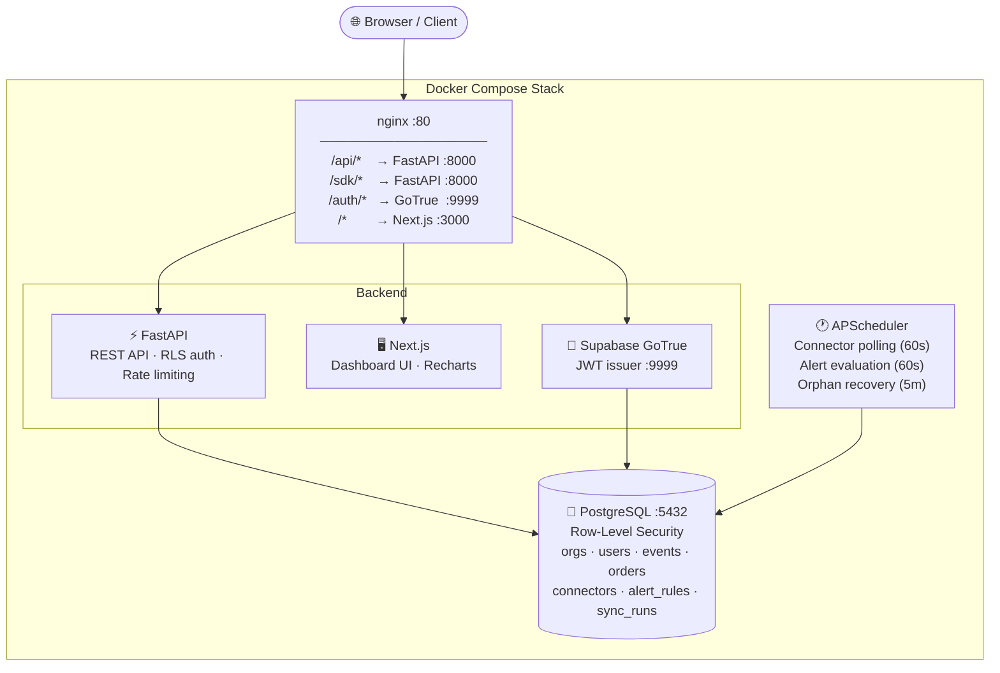

<div align="center">

<h1>📊 Analytiq</h1>

<p><strong>The self-hostable product analytics platform you actually own.</strong><br/>
Event tracking + e-commerce analytics in a single Docker Compose stack — no SaaS fees, no data leaving your servers.</p>

[](https://github.com/Tanya-Gitt/analytiq/actions)
[](LICENSE)
[](https://python.org)
[](https://nextjs.org)
[](https://postgresql.org)
[](https://docs.docker.com/compose)

</div>

---

## Why Analytiq?

| | Analytiq | Segment / Mixpanel | Self-hosted Matomo |
|---|---|---|---|
| **Data ownership** | ✅ 100% yours | ❌ third-party servers | ✅ |
| **Multi-tenant RLS** | ✅ Postgres row-level security | ❌ | ❌ |
| **E-commerce + events** | ✅ both in one platform | events only | events only |
| **Alerting built-in** | ✅ Slack + email | ❌ (paid add-on) | limited |
| **Monthly cost** | ✅ $0 (+ your server) | 💸 $120+/mo | free |
| **One-command deploy** | ✅ `docker compose up` | ❌ | complex |

---

## ✨ Features

**Segment A — Event analytics**
- Browser JS SDK with `identify`, `track`, and `page` calls
- HMAC-signed webhooks and CSV import
- Events timeline, top events, conversion funnel, new vs returning users chart
- Per-event-type filtering with 7 / 30 / 90-day windows

**Segment B — E-commerce analytics**
- Revenue trend, AOV trend, top products, top channels (donut), revenue by region
- Period-over-period comparison badges (vs previous window)
- Per-channel filtering, delivery rate KPI
- Orders via webhook, CSV upload, or Google Sheets polling

**Platform**
- Smart alerting — metric thresholds → Slack or email with auto-resolve
- Multi-tenant by default — Postgres RLS enforces org isolation at the DB layer
- Background sync scheduler — APScheduler polls connectors, evaluates alerts, recovers orphaned runs
- Token-bucket rate limiting — 100 req/s per org, Postgres-backed, survives restarts
- 258 tests, 0 mocks for DB — every test runs against a real Postgres instance

---

## 🏗️ Architecture



**Six containers:** `postgres` · `app` (FastAPI) · `frontend` (Next.js) · `scheduler` · `auth` (GoTrue) · `nginx`

---

## 🚀 Quickstart

### Prerequisites

- Docker + Docker Compose v2
- 1 GB RAM, any Linux/macOS/Windows with WSL2

### 1 — Clone and configure

```bash
git clone https://github.com/Tanya-Gitt/analytiq.git
cd analytiq
cp .env.example .env
```

Open `.env` and set the two required values:

```bash
POSTGRES_PASSWORD=a_strong_random_password
JWT_SECRET=at_least_32_random_chars   # python -c "import secrets; print(secrets.token_hex(32))"
```

### 2 — Start the stack

```bash
docker compose up --build
```

First boot takes ~60 seconds while Postgres initialises. When you see `app | Application startup complete`, open **http://localhost**.

### 3 — Create your workspace and start ingesting

Sign up at http://localhost, then choose how to get your data in:

---

## 📥 Ingestion methods

### A · JavaScript SDK (browser events)

```html
<script src="http://localhost/sdk/analytics.js"></script>
<script>
  Analytics.init('YOUR_ORG_API_KEY', { host: 'http://localhost' });
  Analytics.identify('user-123', { plan: 'pro' });
  Analytics.track('Purchase', { sku: 'PROD-42', price: 29.99 });
  Analytics.page(); // auto-tracks page views
</script>
```

Create a `js_sdk` connector first to allowlist your origin.

### B · Webhook (real-time orders / events)

```bash
# Create a webhook connector
curl -X POST http://localhost/api/connectors \
  -H "Authorization: Bearer $JWT" \
  -H "Content-Type: application/json" \
  -d '{"type":"webhook","segment":"B","config":{"secret":"your-hmac-secret"}}'

# Send a signed order
BODY='{"order_id":"ORD-1","order_date":"2024-03-15","quantity":2,"price_per_unit":49.99}'
SIG=$(echo -n "$BODY" | openssl dgst -sha256 -hmac "your-hmac-secret" | awk '{print $2}')
curl -X POST http://localhost/api/webhook/$CONNECTOR_ID \
  -H "Content-Type: application/json" \
  -H "X-Webhook-Signature: $SIG" \
  -d "$BODY"
```

### C · CSV upload (drag-and-drop)

Go to **Connectors → Add connector → CSV Upload**, map your column headers (e.g. `{"Date": "order_date", "Units": "quantity"}`), and upload. Sync runs immediately.

### D · Google Sheets (scheduled pull)

Publish your Sheet as CSV (**File → Share → Publish to web → CSV format**), create a `sheets_csv` connector with the URL, and the scheduler polls it every 60 seconds.

---

## 🔔 Alerting

Define rules in **Alerts → New alert rule**.

| Metric | Condition | Example |
|---|---|---|
| `total_revenue` | `below` threshold | Revenue drops under $500/day |
| `total_events` | `above` threshold | Spike > 10k events/hour |
| `delivery_rate` | `below` threshold | Delivery rate falls under 95% |
| Any metric | `no_data` | No orders received in last 24h |

The alert FSM handles OK → TRIGGERED → OK transitions automatically and re-notifies after 24h if still firing. Set `SLACK_WEBHOOK_URL` or SMTP vars in `.env` to activate notifications.

---

## 🔒 Security

| Concern | How it's handled |
|---|---|
| **Tenant isolation** | Postgres RLS + `SET LOCAL app.org_id` — enforced at DB layer, not app layer |
| **Auth brute force** | nginx rate-limits `/api/auth/login`, `/api/auth/signup`, `/auth/token` to 5 req/min per IP |
| **Account lockout** | 10 consecutive failed logins locks the account for 15 minutes; constant-time bcrypt dummy hash prevents user enumeration |
| **Webhook authenticity** | HMAC-SHA256 signature verified with `hmac.compare_digest()` (timing-safe); 1 MB payload cap |
| **CSV upload** | 10 MB hard cap enforced before and after read; column names sanitized before DDL |
| **SQL injection** | `sanitize_column_name()` strips all non-`[a-zA-Z0-9_]` chars before any DDL |
| **JWT forgery** | HS256, 24-hour expiry, secret from env — never hardcoded |
| **Clickjacking** | `X-Frame-Options: DENY` + CSP `frame-ancestors 'none'` |
| **Content Security Policy** | Strict CSP on all responses — restricts scripts, styles, frames, and form targets |
| **Supply chain** | All GitHub Actions pinned to SHA hashes, not mutable version tags |
| **Container privilege** | Both `app` and `scheduler` run as non-root `appuser` (uid 1001) |
| **Rate limiting (API)** | 100 req/s token bucket per org, Postgres-backed — survives restarts |

> ⚠️ **Never call `pool.acquire()` directly in route handlers.** Always use `get_org_db` from `app/deps.py` — it sets `app.org_id` inside a transaction so RLS is enforced on every query.

---

## 🧪 Running tests

```bash
# One-time: create the test database
createdb analytics_test

# Install dev deps and run
pip install -r requirements-dev.txt
pytest tests/ -v
```

Tests hit a real Postgres instance — no mocks for the database layer. Set `TEST_DATABASE_URL` to point to a different instance if needed.

```
258 passed in 104s ✓
```

---

## 📁 Project structure

```
analytiq/
├── app/
│   ├── routers/          # FastAPI route handlers (auth, dashboard, connectors, ingest, alerts, webhook)
│   ├── connectors/       # CSV coercion + sync logic (coerce.py, sync.py)
│   ├── deps.py           # RLS dependency injection — read before modifying!
│   └── auth.py           # JWT utilities
├── scheduler/
│   ├── main.py           # APScheduler polling loop
│   ├── metrics.py        # Metric evaluation (revenue, events, delivery rate)
│   └── alert_evaluator.py # Alert FSM (OK ↔ TRIGGERED, notifications)
├── frontend/
│   ├── src/app/          # Next.js App Router pages
│   ├── src/components/   # Recharts dashboards, layout, UI primitives
│   └── src/lib/          # Typed API client + auth helpers
├── sdk/
│   └── analytics.js      # Browser JS SDK (identify, track, page)
├── db/
│   └── schema.sql        # PostgreSQL schema + RLS policies
├── nginx/
│   └── default.conf      # Reverse proxy + rate limiting + security headers
├── tests/                # 258 pytest tests — real Postgres, no DB mocks
├── docker-compose.yml    # Full 6-container stack
└── .env.example          # Copy → .env, fill in 2 values, you're done
```

---

## ⚙️ Environment variables

| Variable | Required | Description |
|---|---|---|
| `POSTGRES_PASSWORD` | ✅ | PostgreSQL password |
| `JWT_SECRET` | ✅ | JWT signing secret (≥ 32 chars) |
| `SMTP_HOST` | optional | SMTP server for email alerts |
| `SMTP_PORT` | optional | SMTP port (default: 587) |
| `SMTP_USER` | optional | SMTP username |
| `SMTP_PASS` | optional | SMTP password |
| `SMTP_FROM` | optional | Sender address |
| `SLACK_WEBHOOK_URL` | optional | Slack incoming webhook URL |

---

## 🤝 Contributing

Pull requests are welcome. For major changes, open an issue first to discuss the direction.

```bash
# Run the full quality gate before submitting
ruff check app/ scheduler/ tests/
mypy app/ scheduler/ --ignore-missing-imports --no-strict-optional
pytest tests/ -q
```

All three must pass green.

---

## 📄 License

AGPL v3 — free for open-source use. Commercial use requires a license. See [LICENSE](LICENSE) or contact purusharth2021@gmail.com.

---

<div align="center">
<sub>Built with FastAPI · Next.js · PostgreSQL · APScheduler · Docker</sub>
</div>
